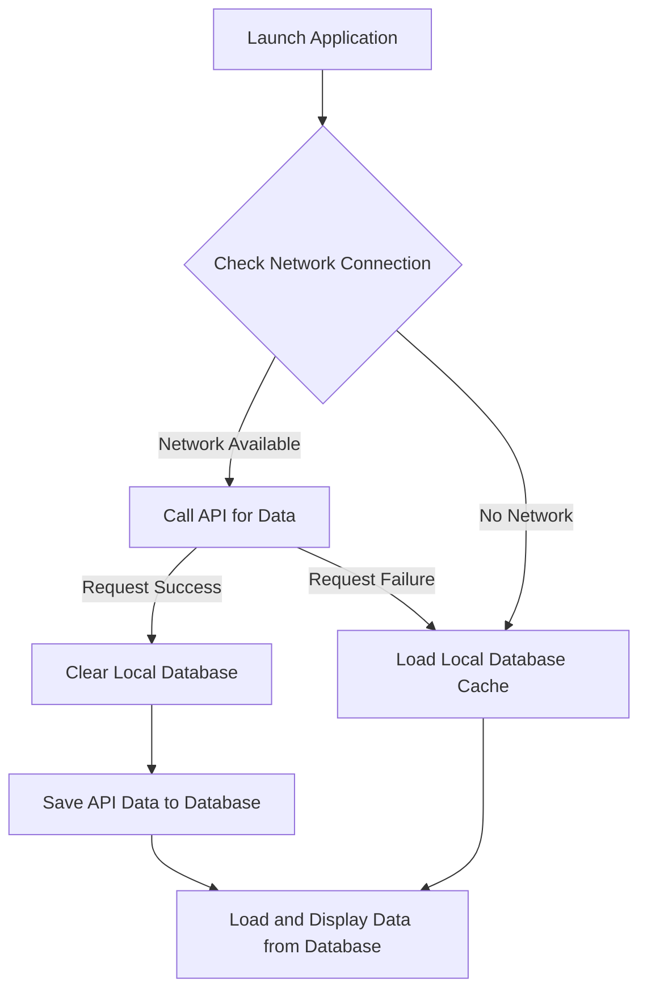
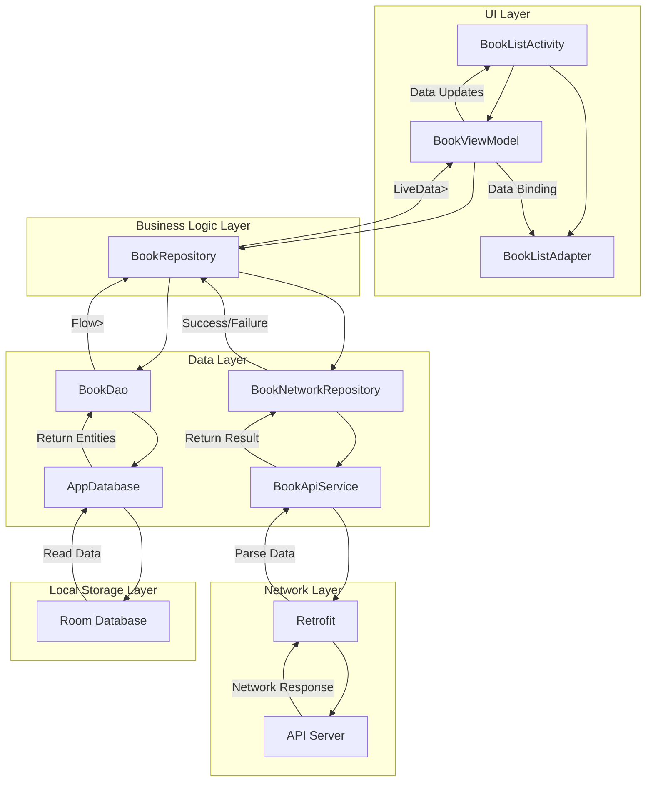

# Screenshot

## Network avaliable

## Network Not avaliable

# Data Loading Flow

# Application Architecture

# The API data is used for third-party services
For example, obtaining all books from the following API:
https://run.mocky.io/v3/6be67997-b989-4864-925a-6b33c49e4848/